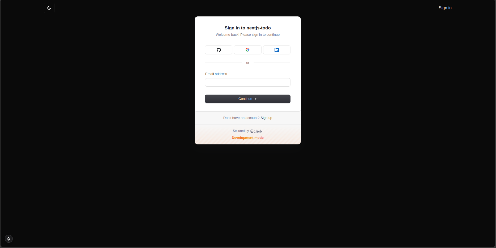
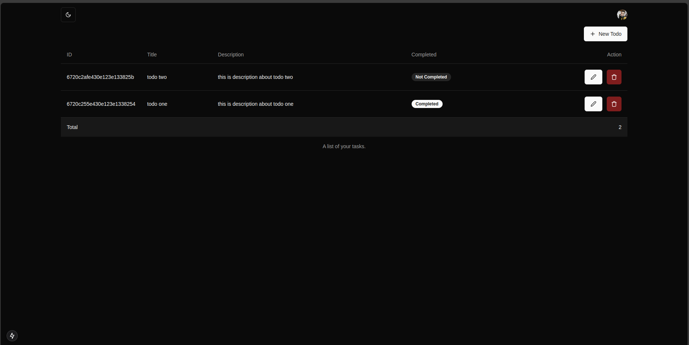
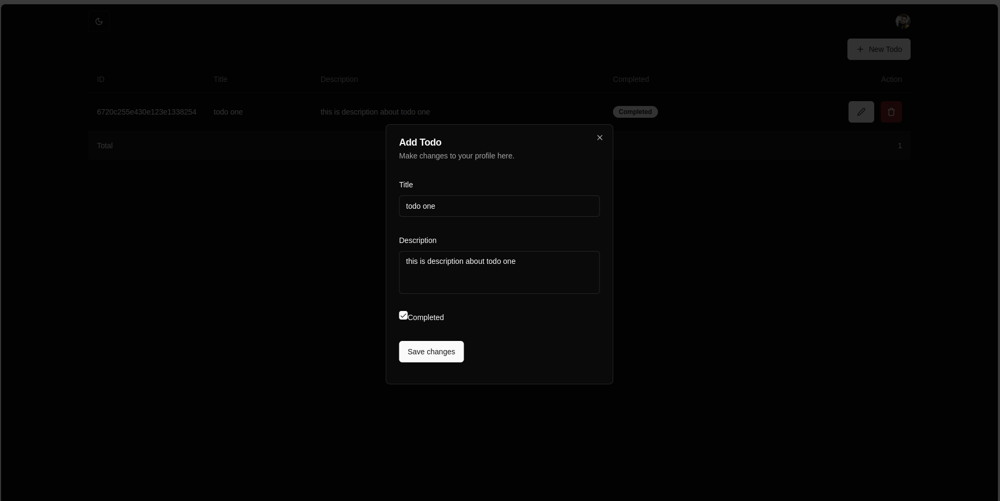
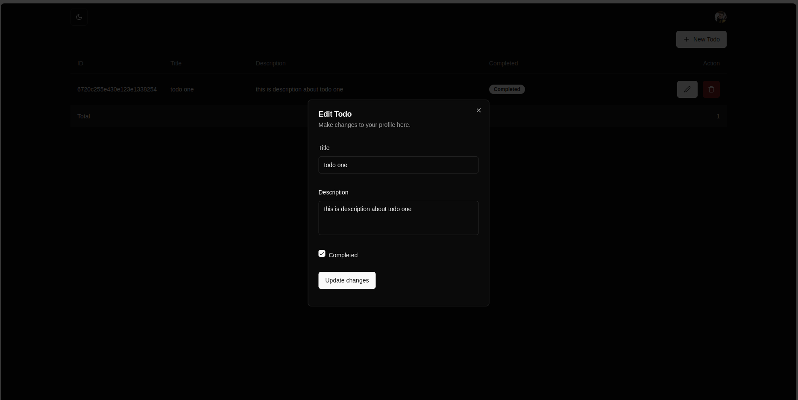
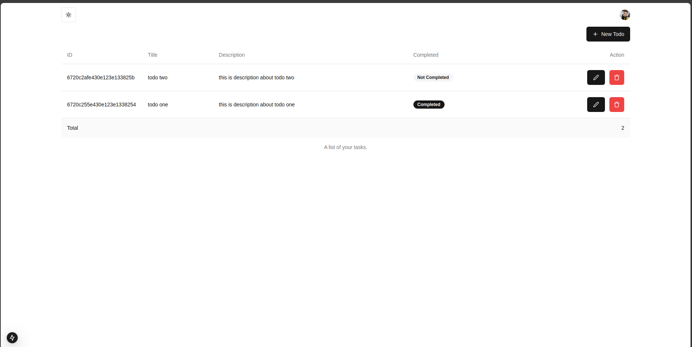

# Next.js Todo App

This is a simple Todo application built with Next.js. It allows users to add, edit, and delete tasks.

## Features

- Authentication
- Add new tasks
- Edit existing tasks
- Delete tasks
- Mark tasks as completed
- Dark and light theme

## Technologies Used

- Next.js,typescript
- Prisma - MongoDB
- React-hook-form
- Tailwind - shadcn/ui
- Zod
- Clerk

## Screenshots

Here are some screenshots of the application:

### Authentication



### Home Page



### Adding a Task




### Editing a Task



### Light mode



 
## Getting Started

### Prerequisites

- Node.js (>= 12.x)
- npm or yarn

### Installation

1. Clone the repository:
   ```bash
   git clone https://github.com/yourusername/nextjs-todo.git
   ```
2. Navigate to the project directory:
   ```bash
   cd nextjs-todo
   ```
3. Install dependencies:
   ```bash
   npm install
   # or
   yarn install
   ```

### Running the Development Server

```bash
npm run dev
# or
yarn dev
```

Open [http://localhost:3000](http://localhost:3000) with your browser to see the result.

## Building for Production

```bash
npm run build
npm start
# or
yarn build
yarn start
```

## Contributing

Contributions are welcome! Please open an issue or submit a pull request.

## License

This project is licensed under the MIT License.

## Acknowledgements

- [Next.js](https://nextjs.org/)
- [React](https://reactjs.org/)
